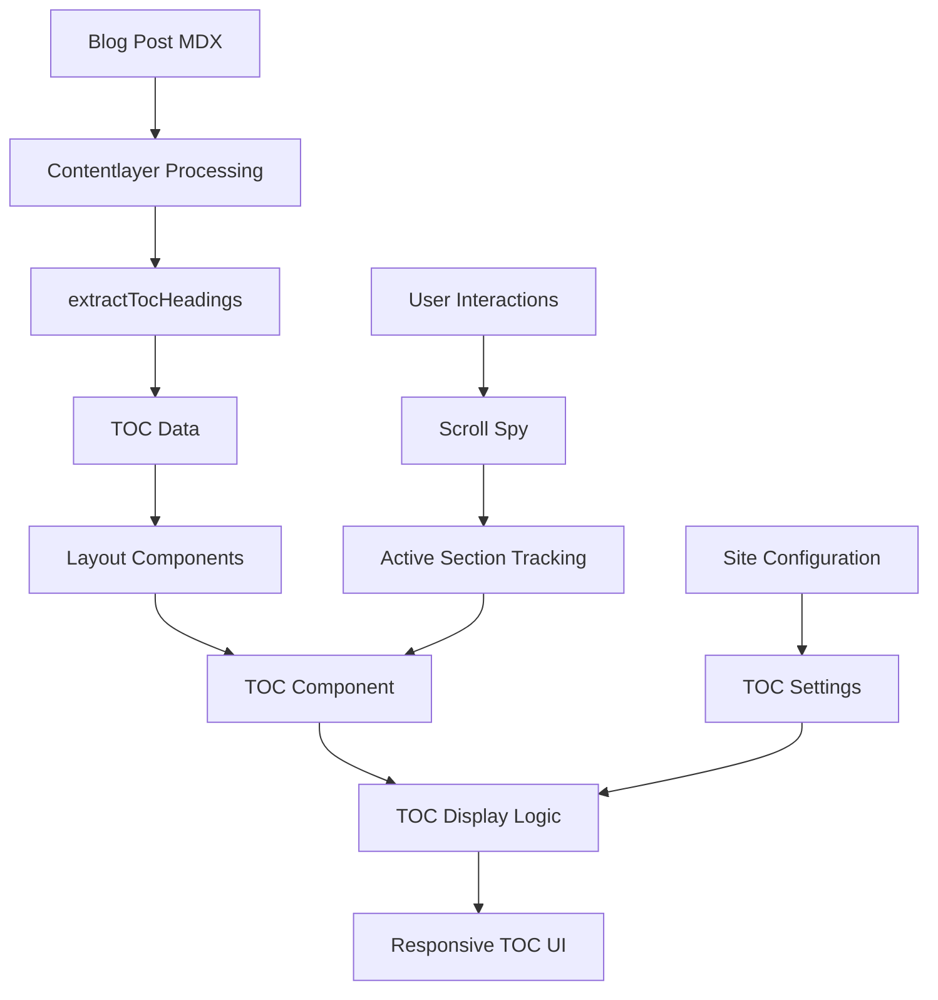
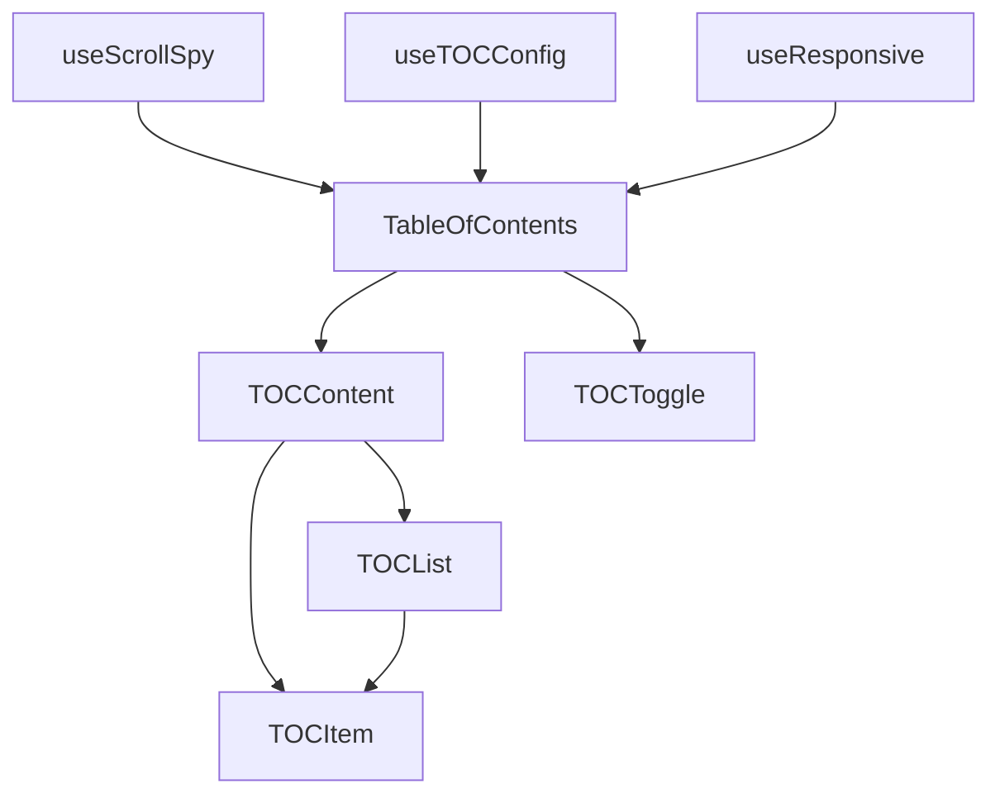

# Blog Table of Contents (TOC) Feature Design

## Overview

This design document outlines the implementation approach for an automatic, modern Table of Contents feature that integrates seamlessly with the existing Next.js blog template. The solution leverages the existing TOC data extraction from `pliny` while adding modern UI components and smart positioning logic.

## Architecture

### High-Level Architecture



### Component Architecture



## Components and Interfaces

### Core Components

#### 1. TableOfContents Component

**Purpose:** Main TOC component that handles rendering, positioning, and responsive behavior.

**Props Interface:**
```typescript
interface TableOfContentsProps {
  toc: TOCItem[]
  className?: string
  position?: 'sidebar' | 'top' | 'floating'
  minHeadings?: number
  maxDepth?: number
  showToggle?: boolean
  sticky?: boolean
}

interface TOCItem {
  value: string
  url: string
  depth: number
}
```

**Key Features:**
- Automatic show/hide based on heading count
- Responsive positioning logic
- Scroll spy integration
- Smooth scroll navigation

#### 2. TOCContent Component

**Purpose:** Renders the actual TOC list with proper styling and interactions.

**Props Interface:**
```typescript
interface TOCContentProps {
  items: TOCItem[]
  activeId: string | null
  onItemClick: (id: string) => void
  maxDepth: number
  className?: string
}
```

#### 3. TOCToggle Component

**Purpose:** Mobile toggle button for collapsible TOC.

**Props Interface:**
```typescript
interface TOCToggleProps {
  isOpen: boolean
  onToggle: () => void
  itemCount: number
}
```

### Custom Hooks

#### 1. useScrollSpy Hook

**Purpose:** Tracks the currently visible heading for active state highlighting.

```typescript
interface UseScrollSpyOptions {
  headingIds: string[]
  rootMargin?: string
  threshold?: number
}

interface UseScrollSpyReturn {
  activeId: string | null
}
```

**Implementation Strategy:**
- Uses Intersection Observer API for performance
- Tracks multiple headings simultaneously
- Handles edge cases (multiple visible headings)
- Respects user's reduced motion preferences

#### 2. useTOCConfig Hook

**Purpose:** Manages TOC configuration and settings.

```typescript
interface TOCConfig {
  enabled: boolean
  minHeadings: number
  maxDepth: number
  position: 'auto' | 'sidebar' | 'top'
  sticky: boolean
}
```

#### 3. useResponsive Hook

**Purpose:** Handles responsive behavior and breakpoint detection.

```typescript
interface UseResponsiveReturn {
  isMobile: boolean
  isTablet: boolean
  isDesktop: boolean
  tocPosition: 'sidebar' | 'top' | 'floating'
}
```

## Data Models

### TOC Data Structure

The existing `extractTocHeadings` function from pliny provides:

```typescript
interface TOCHeading {
  value: string    // Heading text
  url: string      // Fragment identifier (#heading-id)
  depth: number    // Heading level (2-6)
}
```

### Configuration Schema

```typescript
interface TOCSettings {
  // Global settings (in siteMetadata)
  toc?: {
    enabled: boolean
    minHeadings: number
    maxDepth: number
    position: 'auto' | 'sidebar' | 'top'
    sticky: boolean
    showToggle: boolean
  }
}

// Per-post override (in frontmatter)
interface PostFrontmatter {
  toc?: boolean | {
    enabled: boolean
    position?: 'sidebar' | 'top'
    maxDepth?: number
  }
}
```

## Error Handling

### Error Scenarios and Handling

1. **Missing TOC Data**
   - Gracefully hide TOC component
   - Log warning in development mode
   - No impact on page rendering

2. **Invalid Heading IDs**
   - Filter out invalid entries
   - Generate fallback IDs if needed
   - Continue with valid headings

3. **Intersection Observer Not Supported**
   - Fallback to scroll event listeners
   - Throttle scroll events for performance
   - Maintain core functionality

4. **Responsive Breakpoint Issues**
   - Use CSS-based fallbacks
   - Default to mobile-first approach
   - Ensure accessibility is maintained

## Testing Strategy

### Unit Tests

1. **Component Rendering**
   - TOC renders with correct structure
   - Proper heading hierarchy display
   - Responsive class application

2. **Hook Functionality**
   - Scroll spy accuracy
   - Configuration parsing
   - Responsive breakpoint detection

3. **User Interactions**
   - Click navigation works
   - Toggle functionality
   - Keyboard navigation

### Integration Tests

1. **Layout Integration**
   - TOC positioning in different layouts
   - No layout conflicts
   - Proper spacing and alignment

2. **Responsive Behavior**
   - Breakpoint transitions
   - Mobile toggle functionality
   - Sticky positioning

### Accessibility Tests

1. **Screen Reader Compatibility**
   - Proper ARIA labels
   - Semantic HTML structure
   - Focus management

2. **Keyboard Navigation**
   - Tab order correctness
   - Enter/Space key handling
   - Focus indicators

## Performance Considerations

### Optimization Strategies

1. **Lazy Loading**
   - Load TOC component only when needed
   - Defer scroll spy initialization
   - Use React.lazy for code splitting

2. **Event Handling**
   - Throttle scroll events
   - Use passive event listeners
   - Cleanup on component unmount

3. **Rendering Optimization**
   - Memoize TOC items
   - Use React.memo for pure components
   - Minimize re-renders

4. **Bundle Size**
   - Tree-shake unused utilities
   - Use lightweight animation libraries
   - Optimize CSS with Tailwind purging

## Implementation Phases

### Phase 1: Core TOC Component
- Create basic TableOfContents component
- Implement TOCContent and TOCItem
- Add basic styling with Tailwind CSS
- Integrate with existing layouts

### Phase 2: Responsive Behavior
- Implement responsive positioning logic
- Add mobile toggle functionality
- Create responsive hooks
- Test across breakpoints

### Phase 3: Advanced Features
- Add scroll spy functionality
- Implement smooth scrolling
- Add active state highlighting
- Performance optimizations

### Phase 4: Configuration and Polish
- Add configuration options
- Implement per-post overrides
- Add animations and transitions
- Accessibility improvements

## Design Tokens and Styling

### Color Palette
```css
/* Light theme */
--toc-bg: rgb(249 250 251); /* gray-50 */
--toc-border: rgb(229 231 235); /* gray-200 */
--toc-text: rgb(75 85 99); /* gray-600 */
--toc-text-hover: rgb(59 130 246); /* blue-500 */
--toc-text-active: rgb(37 99 235); /* blue-600 */

/* Dark theme */
--toc-bg-dark: rgb(31 41 55); /* gray-800 */
--toc-border-dark: rgb(55 65 81); /* gray-700 */
--toc-text-dark: rgb(156 163 175); /* gray-400 */
--toc-text-hover-dark: rgb(96 165 250); /* blue-400 */
--toc-text-active-dark: rgb(59 130 246); /* blue-500 */
```

### Typography Scale
```css
/* Heading levels in TOC */
.toc-h2 { @apply text-sm font-medium; }
.toc-h3 { @apply text-sm font-normal pl-4; }
.toc-h4 { @apply text-xs font-normal pl-8; }
.toc-h5 { @apply text-xs font-light pl-12; }
.toc-h6 { @apply text-xs font-light pl-16; }
```

### Spacing and Layout
```css
/* TOC container */
.toc-container {
  @apply bg-gray-50 dark:bg-gray-800 rounded-lg border border-gray-200 dark:border-gray-700 p-4;
}

/* TOC positioning */
.toc-sidebar {
  @apply sticky top-24 max-h-[calc(100vh-8rem)] overflow-y-auto;
}

.toc-top {
  @apply mb-8;
}

.toc-floating {
  @apply fixed right-4 top-1/2 transform -translate-y-1/2 max-w-xs;
}
```

## Integration Points

### Layout Integration

1. **PostLayout.tsx**
   - Add TOC to left sidebar on desktop
   - Position above author info
   - Maintain existing grid structure

2. **PostSimple.tsx**
   - Add TOC at top of content area
   - Integrate with existing spacing
   - Maintain clean layout

3. **PostBanner.tsx**
   - Position TOC after banner image
   - Integrate with content flow
   - Maintain visual hierarchy

### Configuration Integration

1. **siteMetadata.js**
   - Add TOC configuration section
   - Define default settings
   - Enable/disable globally

2. **Frontmatter Schema**
   - Add TOC override options
   - Support per-post customization
   - Maintain backward compatibility

### Styling Integration

1. **Tailwind CSS**
   - Use existing design tokens
   - Maintain consistent spacing
   - Support dark mode

2. **CSS Custom Properties**
   - Define TOC-specific variables
   - Enable easy customization
   - Support theme switching

This design provides a comprehensive foundation for implementing a modern, accessible, and performant Table of Contents feature that integrates seamlessly with the existing blog template architecture.